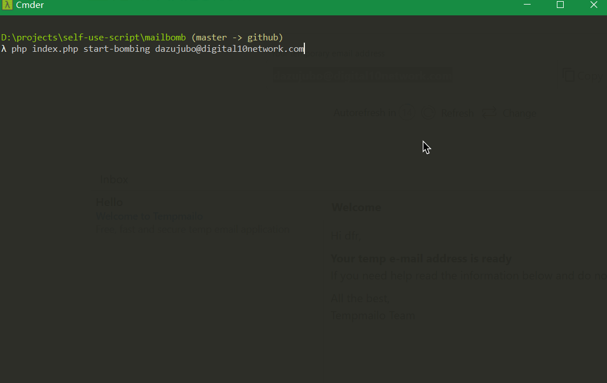
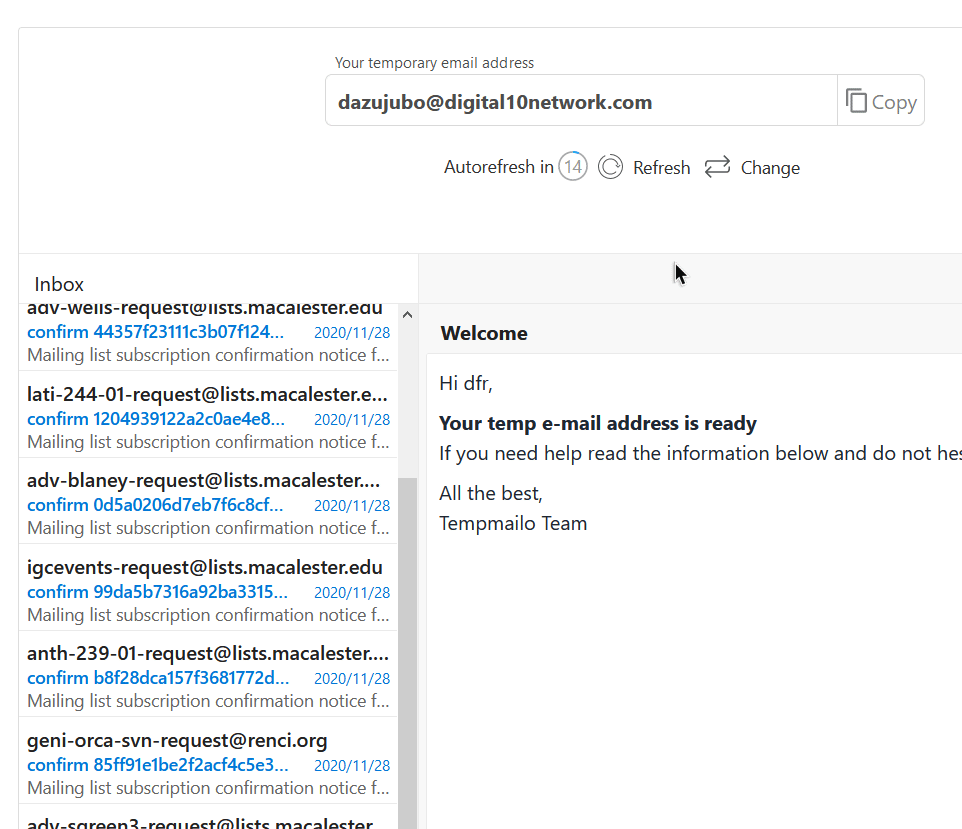

# Fast Mail Bomber via Mailman


English | [简体中文](README_zh-CN.md)

Fast Mail Bomber via Mailman (also FMB for short) is an email bombing/spamming tool written in php. FMB bombs the target's mailbox by sending bulk emails via mailman services hosted by different providers.





**DISCLAIMER: THIS PROJECT IS FOR ACADEMIC PURPOSES ONLY. THE DEVELOPERS TAKE NO RESPONSIBILITY FOR ILLEGAL USAGE AND/OR POTENTIAL HARMS.**

## Requirements

- PHP >= 7.2
- cURL extension support

## Features

- Automatically get mailman servers (providers) from Shodan or import from local files.
- Multithreading bombing process.
- 900+ built-in providers & 50,000+ built-in nodes list, providing efficiency.
- Reliable exception handling mechanism.

## Installation

### 1. Clone this project

You can use git to clone this project or download .zip file from GitHub.

```bash
git clone https://github.com/juzeon/fast-mail-bomber.git
cd fast-mail-bomber/
```

### 2. Configure

Copy `config.example.php` to `config.php` and edit it according to the annotations in the file to suit your needs.

## Usage

**Concept explanations:**

Provider: A mailman server, which usually contains a `listinfo` page listing all subscription nodes. eg. `http://lists.centos.org/mailman/listinfo`

Node: A subscription node on a mailman server, which can be used to send subscription confirmation emails to a target. eg. `http://lists.centos.org/mailman/subscribe/centos`

### 1. (Optional) Updating Providers from Shodan & ZoomEye or a local file

```bash
# Updating providers from Shodan & ZoomEye. Set a Shodan and/or ZoomEye api key in config.php first.
php index.php update-providers

# Importing providers from a local file. There's no restriction on file format/pattern since FMB uses RegExp to match provider urls.
php index.php import-providers <filepath>
```

Duplicate providers will be automatically removed.

### 2. (Recommand) Updating Nodes from the existing provider list

```bash
# Optional. Due to various factors of different network environments, the built-in nodes may not work in your environment. So it's a good idea to delete these nodes (but not data/providers.json) and execute update-nodes on your own. Depending on the speed of your network and the size of our providers list, it may take 10~30 minutes.
rm -rf data/nodes.json data/dead_providers.json

# Getting all subscription nodes that can be used for bombing from providers.
php index.php update-nodes

# Optional. Refine only one node from each provider, which will be extracted into a different file.
php index.php refine-nodes
```

When getting nodes, unavailable providers previously added will be automatically added to a dead list and will not be used.

Duplicate nodes will be automatically removed.

You can also use built-in providers and nodes and skip this step.

### 3. Starting to bomb

```bash
php index.php start-bombing [refined] <email address>

# eg. Use all nodes to bomb an email:
php index.php start-bombing email@example.com

# eg. Use refined nodes to bomb an email:
php index.php start-bombing refined email@example.com
```

Successful and failed requests will be printed via console. Press CTRL+C to cease the process.

**DISCLAIMER: THIS PROJECT IS FOR ACADEMIC PURPOSES ONLY. THE DEVELOPERS TAKE NO RESPONSIBILITY FOR ILLEGAL USAGE AND/OR POTENTIAL HARMS.**

## Testing results

I tested FMB's performance when bombing different mail providers once. Here's the results:

Proton Mail: 99.4% into Inbox, 0.6% into Spambox.

Gmail: 83.2% into Inbox, 16.8% into Spambox.

Outlook Mail: 77.1% into Inbox, 22.9% into Spambox.

163 Mail: 100% into Inbox, 0% into Spambox.

QQ Mail: 71% into Inbox, 29% into Spambox.

Zoho Mail: 0% into Inbox, 15.9% into Newsletter, 84.1% into Spambox.

Yandex Mail: 0% into Inbox, 100% into Spambox.

## How to prevent being bombed

Because of the mail template used in mailman's default settings, simply add the following text as one of your mailbox's filter rule:

```
Mailing list subscription confirmation notice for mailing list
```

## License

GPL v2.0